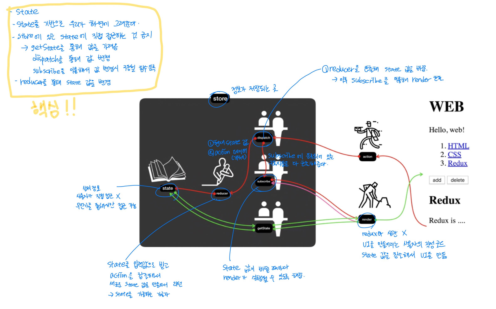

# react-study

 

## Component
- 작업의 단위
- 코드의 가독성을 높일 수 있다
- 재사용성이 높다
- 유지보수가 편리해진다
- 컴포넌트는 반드시 하나의 최상위 태그로 시작해야 한다

 

## 개발환경 구축하기
- 설치  
`npm install -g create-react-app`
- 설치 확인  
`create-react-app -V`
- 프로젝트 생성하기
  1. 빈 폴더를 만든다
  2. 폴더의 경로로 들어가 `create-react-app .` 입력
  3. 프로젝트 생성 완료

 

## 실행하기
`npm run start`

 

## npm 과 npx의 차이
- npm이 그 프로그램을 설치하는 거라면
- npx는 create-react-app을 한 번만 설치한다.
  - 메모리를 차지하지 않는다.
  - 다운로드 받을 때마다 최신 상태이다.

 

## 프로젝트 구조
- public
  - index.html이 들어있다

 

## 클래스형 vs. 함수형

 

## 배포하기
`npm run build`

 

## props
- 사용자가 조작하는 부분
- 사용자가 컴포넌트를 사용하는 입장에서 중요
- 사용자에게 중요한 정보

 

## state
- props의 값에 따라 내부의 구현에 필요한 데이터들
- 컴포넌트 내부에서 쓰이는 값
- 실제로 다양한 컴포넌트를 만들 때 필요한 요소

## constructor
- 컴포넌트에 constructor가 있다면 맨 먼저 실행되어 초기화된다
- render가 되기 전에 props의 값을 초기화시킬 수 있다

 

## JSX
- JavaScript XML

 

## React class vs. function style
### class
- react의 기능을 풀파워로 사용할 수 있다
- class 문법 알아야 되고 장황하다
### function
- 함수의 문법만 알면 사용할 수 있다
- 기능이 부족하다
  - hook
    - 함수 방식에서도 내부적으로 상태를 다룰 수 있게 되었고
    - 컴포넌트의 라이프 사이클에 따른 것을 할 수 있게 되었다

###
- props는 class, function style에서 다 쓸 수 있었지만
- state는 클래스에서만 가능했다

 

## react router dom
`npm install react-router-dom`
- 사용자가 주소로 들어왔을 때 그에 맞는 적당한 페이지를 보여준다

 

### BrowserRouter
- 리액트 라우터 돔을 적용하고 싶은 컴포넌트의 최상위 컴포넌트를 감싸주는 최상위 컴퍼넌트
### Route
- `<Route path="/"><Component></Component></Route>`
- path에 해당하는 주소로 접근하면 그에 맞는 컴포넌트를 띄워준다
### Switch
### Link
- `<Link to="/">hello</Link>`
- to 뒤에 쓰여진 주소로 이동한다
### HashRouter
- 어떤 path로 들어오건 간에 루트 페이지에 해당하는 html 파일을 서비스할 수 있다면 사용
### NavLink
- `<NavLink to="/">hello</NavLink>`
- 선택된 라우터만 `class="active"` 로 설정된다
- 사용자가 어디에 접근하는지 쉽게 확인할 수 있다

# Redux
- A predictable state container for JavaScript apps.
- 애플리케이션의 복잡성을 획기적으로 낮춰서 우리의 코드가 어떤 결과를 가져올지 예측 가능하게 만들어주는 도구
- Single Source of Truth : 하나의 상태를 갖는다
- dispatcher, reducer 등을 통해서만 state를 수정할 수 있다
- 데이터를 외부에서 직접적으로 접근하는 것을 막음으로써 의도치 않게 state 값이 바뀌는 것을 막음으로써 애플리케이션을 보다 예측 가능하게 만든다
- undo/redo를 쉽게 할 수 있다
  - 각각의 state 값을 생성할 때 철저하게 통제하고, 데이터를 만들 때 원본을 만드는 것이 아니라 복제하고, 복제한 데이터를 수정하고 그것을 원본으로 만드는 방법을 채택하기 때문에, 각각의 변화가 서로에게 전혀 영향을 주지 않고 독립적인 상태를 유지할 수 있고, 이러면 unde/redo 등 매우 쉽게 처리할 수 있다
- 현재 상태 뿐만 아니라 이전의 상태까지도 꼼꼼하게 레코딩하는 것을 통해서 과거의 어느 시점으로 돌아가서 이 애플리케이션의 시점이 무엇인가를 찾는 것을 통해서 문제 해결을 하는 것을 쉽게 도와준다
- module reloading 가능

## 구성
### store
- redux의 핵심
- state : 실제 정보가 저장됨
- reducer : 함수
- dispatch

### render
- UI를 만들어주는 부분 

## 진행순서
- render -> dispatch -> state -> dispatch -> render -> UI 반영
- state 값이 바뀔 때마다 render가 실행된다면 좋지 않을까? -> 이 때 사용하는 게 subscribe
- subscribe에 등록해두면 state가 바뀔 때마다 UI가 갱신된다

  
## redux의 특징
- 중앙집중적인 데이터 스토어를 통해서 애플리케이션을 쉽게 개발할 수 있다
- 시간여행이 가능하다 (크롬 확장프로그램 이용)

## state의 값을 변경할 때 직접 접근 X
- Object.assign 을 이용해 값을 복사한 뒤 그 값을 리턴해준다
- Object.assign({}, {name:''}, {city:''});
  - -> {name:'', city:''}
  - 첫번째 인자에는 빈 객체를 주어야 함

## 마무리
- react와 단짝
- 준수한 생태계
- Immutability

# React Redux
## React
- 사용자 정의 태그(컴포넌트)를 만들어서 체계적이고 잘 정돈된 애플리케이션을 만들게 해주는 기술
## Redux
- 상태를 중앙에서 관리하는 것을 통해서 데이터가 우리가 예측하지 않은대로 변형되는 가능성을 낮춰주는 기술
둘 모두 개발의 복잡성을 낮춰준다

## createStore
- 첫 번째 인자 : reducer(함수)
  - reducer의 인자 : state, action
  - state : 데이터
  - action : 데이터에 가해져야 하는 여러가지 행위들
  - 기본적으로 state를 return

## react 컴포넌트에서 redux에 종속된 기능을 제거
store를 사용하면 컴포넌트 재사용이 불가할 수도 있다
-> wrapping을 사용해 해결

# React-Redux
`npm install react-redux`
- 기존 containers에서 했던 작업을 connect 함수를 이용해 간단하게 바꿀 수 있다
- `connect()()`의 모습을 하고 있음
  - 첫번째 ()에서는 `mapStateToProps`, `mapDispatchToProps` 함수 두 개를 인자로 받음
    - mapStateToProps : redux의 store의 state를 react의 props로 전달, 매핑시켜주는 정보를 담은 함수
    - mapDispatchToProps : redux의 dispatch를 react의 컴포넌트의 props로 연결시켜주는 정보를 담고 있는 함수를 만들어 공금해주면 복잡한 작업은 알아서 해줌 
  - 두 번째 ()에서는 wrapping할 컴포넌트를 넣어줌 